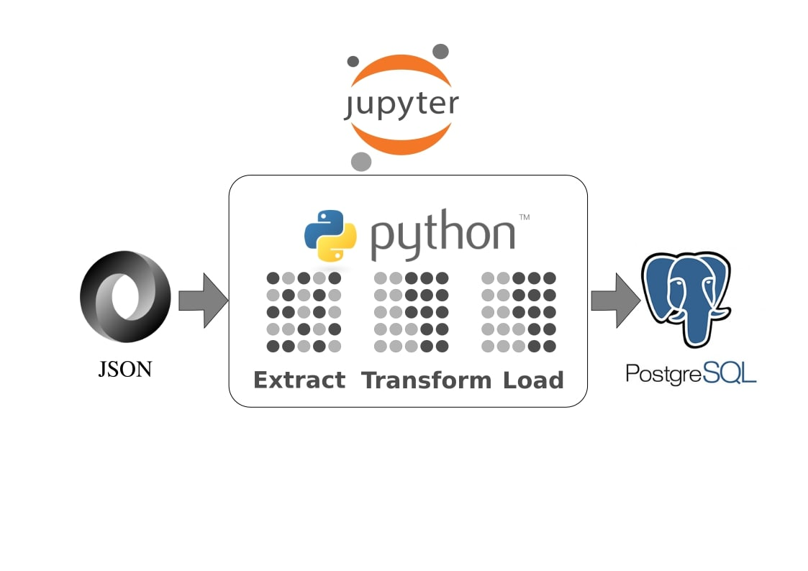
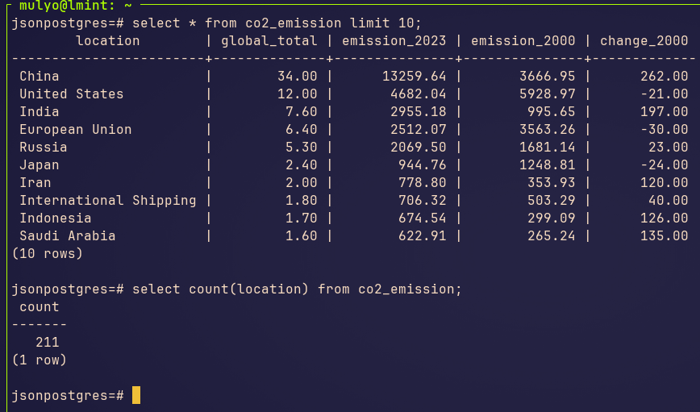

# jupyter_json_postgresql

# *Overview*
Project repo to demonstrate ETL process in Jupyter Notebook, using JSON file as data source, using python pandas for data transformation (data cleaning, correcting data type, removing missing value) and data load into Postgresql as database. Utilize pandas library to conduct data transformation, this repo to demonstrate how to provide qualified data and ready to be used for further analysis or insight.
# *Prerequisites*
To follow along this project there minimum requirements on system:
- python3 and jupyter notebook, pandas installed
  ```bash
  sudo apt install python3
  ```
  ```bash
  pip install pandas, jupyter
  ```
- postgresql running
  ```bash
  sudo systemctl status postgresql
  ```
# *Project Flow*
Data ingestion from JSON to postgreSQL:
1. Import necessary python library -- pandas, json, sqlalchemy, psycopg2
   ```python3
   import pandas as pd
   import json
   ....
   from sqlalchemy import create_engine
   import psycopg2
   ```
2. [E]xtract json to pandas data frame
   ```python3
   df = pd.DataFrame(data)
   ```
3. [T]ransform pandas data fram -- remove unnecessary string & convert object to numeric
   ```python3
   # remove unnecessary string
   df['% of global total'] = df['% of global total'].str.replace('%', '', regex=False)
   # correcting data type
   df['% of global total'] = pd.to_numeric(df['% of global total'], errors='raise')
   ```
4. Create connection to postgreSQL
   ```python3
   db_config = {
    'host':'localhost',
    'database':'jsonpostgres',
    'user':'*****',
    'password':'*****'
   }

   conn = psycopg2.connect(**db_config)
   ```
5. [L]oad to postgreSQL
    ```python3
    engine = create_engine(f"postgresql+psycopg2://{db_config['user']}:{db_config['password']}@{db_config['host']}:{db_config.get('port', 5432)}/{db_config['database']}")
    df.to_sql(table_name, engine, if_exists='append', index=False)
    ```
6. Close the connection
    ```python3
    conn.close()
   ```
7. MySQL result
   

